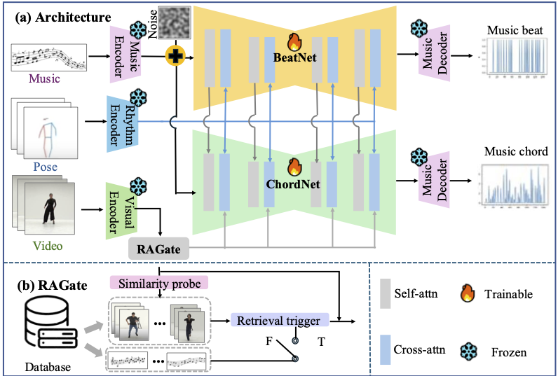

## Soundtrack Your Motion: Enhancing Rhythmic Soundtrack Generation with Adaptive Retrieval Reference
Jinting Wang, Li Liu, Jun Wang
## 1. Project Overview
Given an human motion video, our goal is to compose music piece that matches the motion rhythm and style. In order to achieve this goal, we propose a novel easy-to-hard framework with retrieval-augmented technique for video soundtrack generation. 

	
