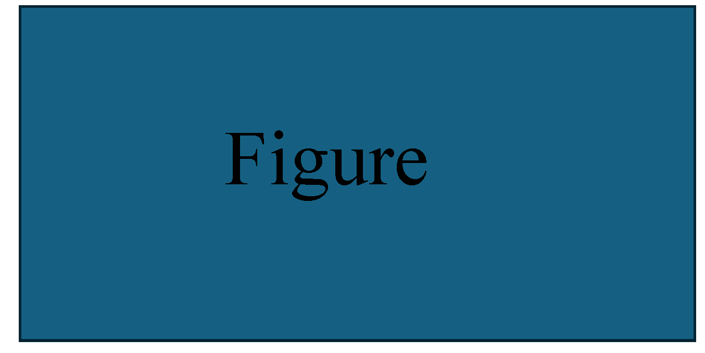

## Soundtrack Your Motion: Enhancing Rhythmic Soundtrack Generation with Adaptive Retrieval Reference
Jinting Wang, Li Liu, Jun Wang
## 1. Project Overview
Given an human motion video, our goal is to compose music piece that matches the motion rhythm and style. In order to achieve this goal, we propose a novel easy-to-hard framework with retrieval-augmented technique for video soundtrack generation. 

	

## 2.Various Generated Samples
<table class="center">
<tr>
    <td width=33% style="border: none">
        <video controls autoplay loop src="./examples/video_refine_generated_gWA_sFM_c08_d27_mWA0_ch15.mp4" muted="false"></video>
    </td>
    <td width=33% style="border: none">
        <video controls autoplay loop src="./examples/video_refine_generated_gPO_sFM_c09_d11_mPO5_ch13.mp4" muted="false"></video>
    </td>
    <td width=33% style="border: none">
        <video controls autoplay loop src="./examples/video_refine_generated_gBR_sFM_c01_d05_mBR3_ch10.mp4" muted="false"></video>
    </td>
</tr>

</table>

